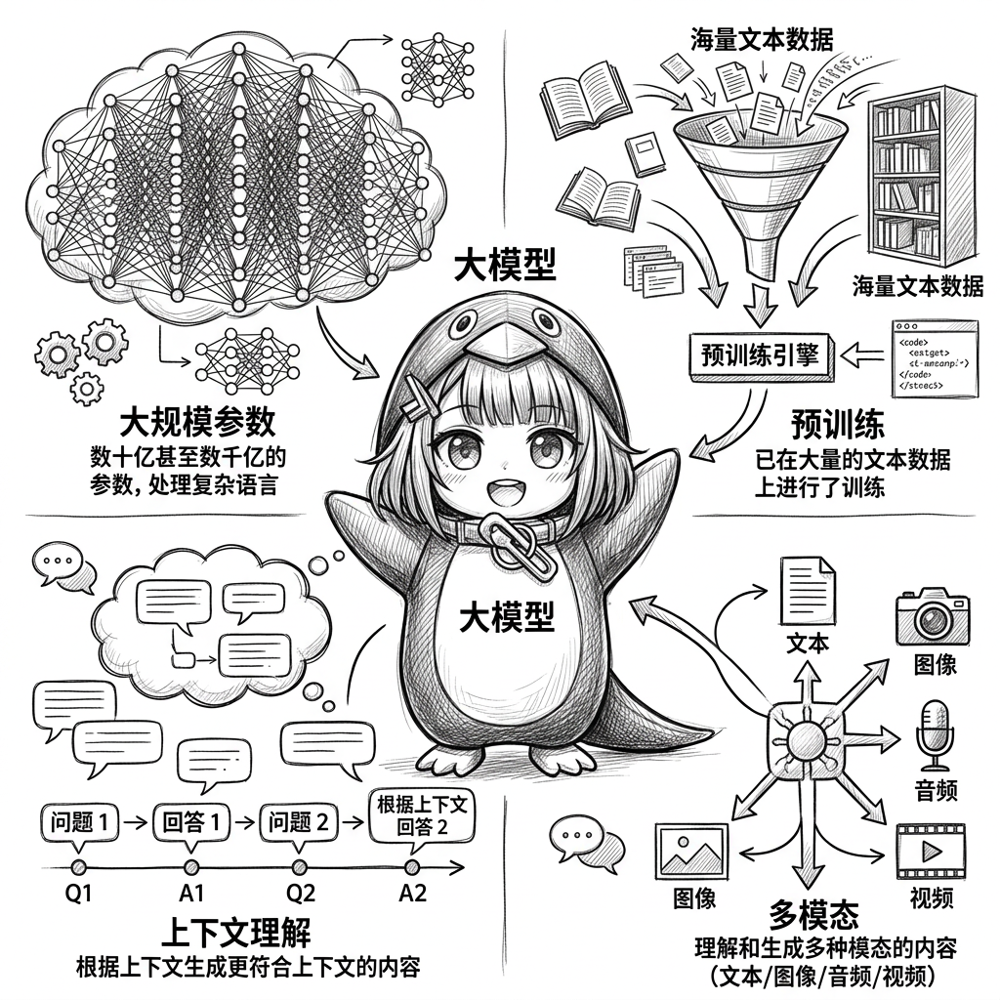
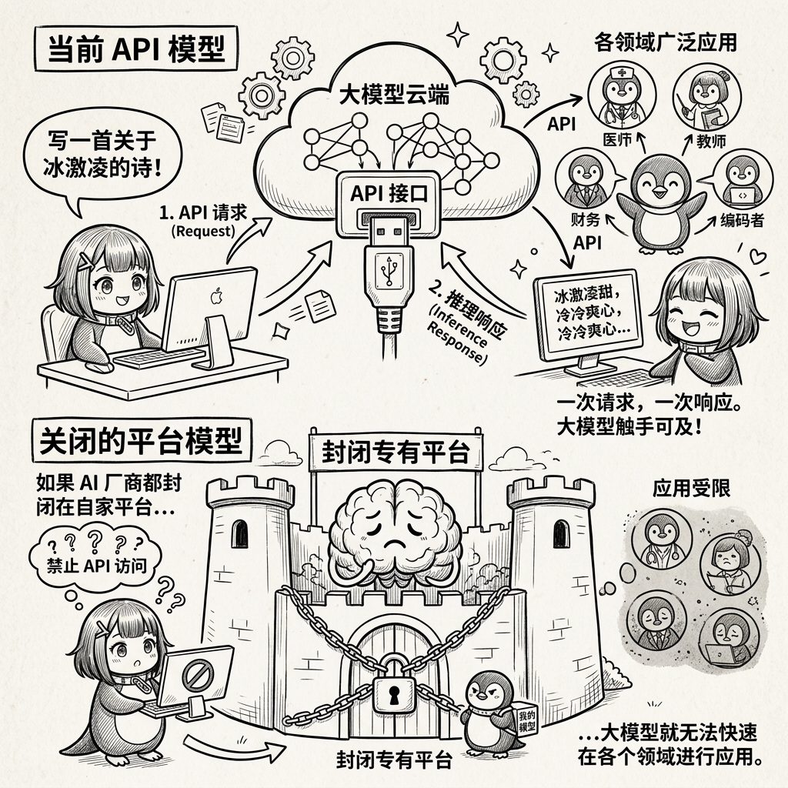
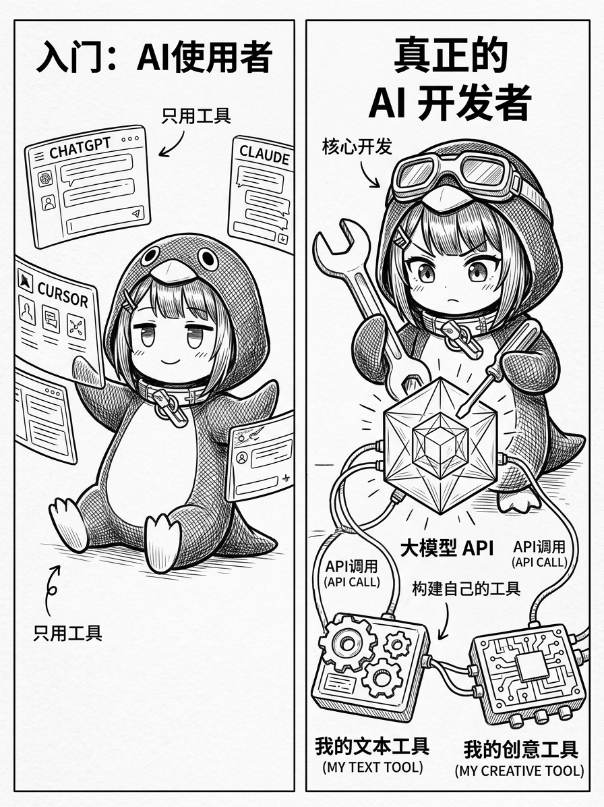
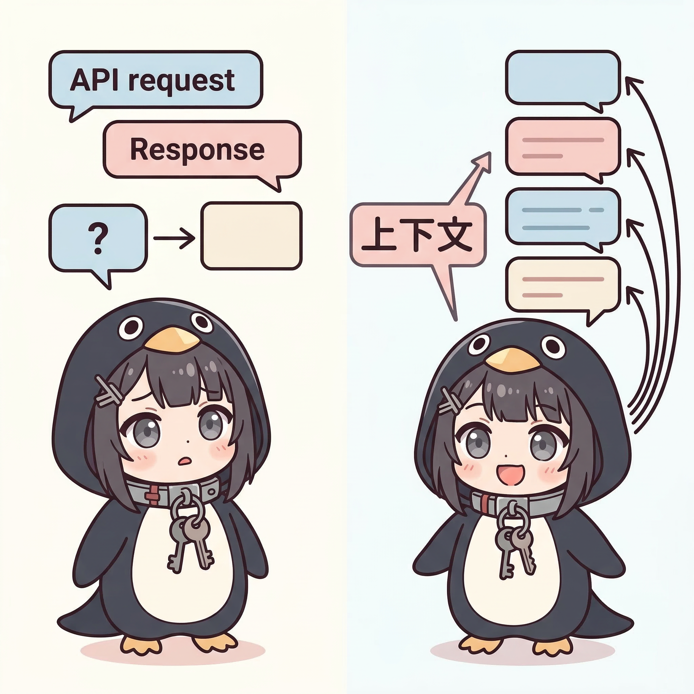

## 前言

随着大语言模型（LLM）能力的不断增强，围绕 AI 的开发生态也在快速演进。MCP、Agent、Subagent、Skills, Agent Team, plugins, hooks, commands 这些概念频繁出现在各类工具和框架中，但是各种名词的快速涌现，往往让大家觉得混乱，它们之间的关系并不总是一目了然。这篇文章尝试用简洁的方式梳理这些概念。以及解析这些概念表现了 AI 技术发展过程中的哪些特点。

顺便从 「夯」到「拉」来给这些概念分个级，也让大家知道哪些是我们必须了解的。哪些只需要了解即可。


## 大模型 LLM

大模型，通常指的是一个预训练的神经网络模型，它能够理解和生成自然语言。大模型通常具有以下特点：

- 大规模参数：大模型通常具有数十亿甚至数千亿的参数，这使得它们能够理解和生成更复杂的语言。
- 预训练：大模型通常是预训练的，这意味着它们已经在大量的文本数据上进行了训练，这使得它们能够理解和生成更复杂的语言。
- 上下文理解：大模型通常能够理解上下文，这意味着它们能够根据上下文生成更符合上下文的内容。
- 多模态：大模型通常能够理解多种模态，这意味着它们能够理解和生成多种模态的内容。

LLM 是一切 AI 技术的起点，没有他就没有后续的一系列概念，评价为「夯中夯」



## 大模型 API 

目前所有的厂商的大模型，都是通过 API 接口的方式提供服务，用户通过 API 接口的方式，调用大模型进行推理。我们和大模型交互的方式，往往就是一次请求，一次响应。构成了一次请求-响应的交互。这个也是大模型能够快速在各个领域进行应用的基础。如果 AI 厂商都只把大模型封闭在自家平台，那大模型就无法快速在各个领域进行应用。


评价为「夯」，还有一点很重要，如果你只会使用各种 AI 工具，比如 chatgpt，claude，cursor，你只能算是入门，离真正的 AI 开发还有很远的距离。只有你真正的调用过大模型 API，并尝试利用它做出
你自己的工具，你才能算是真正的 AI 开发者。



## 对话

一次 API 请求-响应的交互是没办法追问的，因为 AI 并不知道你上一次的请求是什么，所以它无法根据上一次的请求来生成更符合上下文的内容。
所以为了实现追问，我们引入了对话的概念。对话是多次 API 请求-响应的交互，每一次新的请求，都包含了上一次，甚至更早的请求和响应的内容。
也就是所谓的上下文。



这里有两个重要的点，首先大模型的上下文长度是有限度的，虽然现在很多大模型都支持了长上下文，但是终究有一个限度，所以不存在无限对话的助手，其次，每一次对话带上了之前所有的上下文，消耗的 token 也会每次都变多，而不是只看你新增的内容。如果一直对话下去， token 的消耗是成倍增长的，所以需要及时清理上下文，避免 token 的浪费。


总的来说，这个概念让简单的一次性对话变成了能不断追问的对话助手，评价为「夯」。

## Memory 

对话的上下文往往是只在一次对话中有效，也就是所谓的上下文。但是有时候我们希望 AI 能够记住一些信息，比如一些历史信息，或者一些上下文信息，这时候我们引入了 Memory 的概念。Memory 是 AI 能够记住一些信息，比如一些历史信息，或者一些上下文信息。这些信息是我们之前对话中 AI 总结生成的，并且会自动更新，并在后面的对话中提前加入到上下文。


好处在于，AI 是可以成长的，他可以记住你的职业，你的爱好，你的能力，从而针对性的回答和你相关的内容，让 AI 更加个性化，从一个简单的问答机器人变成你的贴心助手。

Memory 的问题在于，如果 Memory 的内容过多，会导致上下文过长，影响大模型的理解能力。所以需要对 Memory 进行管理，只保留最相关的信息。同时，什么情况下应该传入什么样的 memory ，
也是需要考虑的。

在我使用 chatgpt 的过程中，会发现他每次都会基于我的一个职业进行记忆，比如我是一个开发者，他就会基于我的职业进行记忆，比如我是一个产品经理，他就会基于我的职业进行记忆。但是有时候我问一个关于生病的问题，他依然还拿着我的开发者记忆，追问我是否想要制作一款和这个病症相关的 APP。这时候我就会觉得他脑子是否有点问题

总体评价为「顶级」，记忆功能让 AI 变得更加智能，更加个性化，更加贴心，更加符合用户的需求。

## 工具(function call)

到了这一步，我们发现，AI 已经可以完成一些简单的任务了，但是这些任务往往是简单的，比如回答问题，或者生成一些简单的文本。但是一个问题就是，大模型的训练数据是老旧的，他并不知道现在的世界是怎么样的，所以在回答当前时间的信息的时候，往往会进行胡编乱造。我们希望 AI 能够搜索互联网，获取最新的信息。最简单的版本，就是让 AI 告诉我们要搜索什么，然后我们自己去搜索，再返回给 AI。

这很显然是一个非常低效的方式，更方便的方法，我们编写一个函数，然后让 AI 输出这个这个函数的名称，调用参数，然后我们获取 AI 的返回结果，解析成函数调用，再将函数调用结果返回 AI。这就是所谓 function call 的概念。


最开始 openai 的 api 是两个参数 functions(模型可能生成 JSON 输入的函数列表。) 和 function_call(控制模型调用哪个（如果有的话）函数。)，这么命名主要是延续了程序员的思想，现在已经被 tools 和 tool_choice 替代了，从命名上更符合大众的认知。


我们看 claude 官方提供的 web_search 工具的示例代码，因为他们写的比较清楚

```bash
curl https://api.anthropic.com/v1/messages \
    --header "x-api-key: $ANTHROPIC_API_KEY" \
    --header "anthropic-version: 2023-06-01" \
    --header "content-type: application/json" \
    --data '{
        "model": "claude-opus-4-6",
        "max_tokens": 4096,
        "messages": [
            {
                "role": "user",
                "content": "Search for the current prices of AAPL and GOOGL, then calculate which has a better P/E ratio."
            }
        ],
        "tools": [{
            "type": "web_search_20260209",
            "name": "web_search"
        }]
    }'

```

通过 tools 参数，我们告诉大模型，你可以使用 web_search 工具去进行搜索。这个 web_search 工具是 anthropic 提供的，但是其他厂商的大模型，也可以提供自己的工具。可能会相应的收取一定的工具调用费用。返回结果如下 

```json
{
  "role": "assistant",
  "content": [
    // 1. Claude's decision to search
    {
      "type": "text",
      "text": "I'll search for when Claude Shannon was born."
    },
    // 2. The search query used
    {
      "type": "server_tool_use",
      "id": "srvtoolu_01WYG3ziw53XMcoyKL4XcZmE",
      "name": "web_search",
      "input": {
        "query": "claude shannon birth date"
      }
    },
    // 3. Search results
    {
      "type": "web_search_tool_result",
      "tool_use_id": "srvtoolu_01WYG3ziw53XMcoyKL4XcZmE",
      "content": [
        {
          "type": "web_search_result",
          "url": "https://en.wikipedia.org/wiki/Claude_Shannon",
          "title": "Claude Shannon - Wikipedia",
          "encrypted_content": "EqgfCioIARgBIiQ3YTAwMjY1Mi1mZjM5LTQ1NGUtODgxNC1kNjNjNTk1ZWI3Y...",
          "page_age": "April 30, 2025"
        }
      ]
    },
    {
      "text": "Based on the search results, ",
      "type": "text"
    },
    // 4. Claude's response with citations
    {
      "text": "Claude Shannon was born on April 30, 1916, in Petoskey, Michigan",
      "type": "text",
      "citations": [
        {
          "type": "web_search_result_location",
          "url": "https://en.wikipedia.org/wiki/Claude_Shannon",
          "title": "Claude Shannon - Wikipedia",
          "encrypted_index": "Eo8BCioIAhgBIiQyYjQ0OWJmZi1lNm..",
          "cited_text": "Claude Elwood Shannon (April 30, 1916 – February 24, 2001) was an American mathematician, electrical engineer, computer scientist, cryptographer and i..."
        }
      ]
    }
  ],
  "id": "msg_a930390d3a",
  "usage": {
    "input_tokens": 6039,
    "output_tokens": 931,
    "server_tool_use": {
      "web_search_requests": 1
    }
  },
  "stop_reason": "end_turn"
}
```

可以看到返回结果中，有一个 server_tool_use 字段，这个字段就是大模型调用工具的记录。当大模型认为需要调用 web_search 进行搜索的时候，
他会传入了 input.query 参数，这个参数就是要搜索的查询。这个返回会触发工具调用。

工具返回了结果 web_search_tool_result， 里面包含了搜索结果，最后由大模型对工具的调用结果进行查看，总结，再返回给请求。这样大模型就拥有了在互联网进行搜索的能力。

当然这里的搜索工具是由 anthropic 提供的，属于服务端工具，并不是很通用，除此之外还可以自己定义客户端工具。

> 
> 
> 
> 客户端工具：
> 
> - 在您的系统上执行的工具，包括：您创建和实施的用户定义自定义工具
> - Anthropic 定义的工具，如计算机使用和文本编辑器，需要客户端实现
> 
> 服务器工具：在 Anthropic 的服务器上执行的工具，如网络搜索和网络获取工具。这些工具必须在 API 请求中指定，但不需要您进行实现。
>

客户端工具的使用方式如下，

```json
{
  "model": "claude-sonnet-4-5-20250929",
  "messages": [{"role": "user", "content": "Tell me the weather in San Francisco."}],
  "tools": [
      {
        "name": "get_weather",
        "description": "Get the current weather in a given location",
        "input_schema": {
          "type": "object",
          "properties": {
            "location": {
              "type": "string",
              "description": "The city and state, e.g. San Francisco, CA"
            }
          },
          "required": ["location"]
        }
      }
    ]
}
```

返回结果如下，

```json
{
    "index": 0,
    "message": {
        "role": "assistant",
        "content": null,
        "tool_calls": [
            {
                "id": "toolu_bdrk_018qFTn1Mqm5zqU8MguRJbM4",
                "type": "function",
                "function": {
                    "name": "get_weather",
                    "arguments": "{\"location\":\"San Francisco, CA\"}"
                }
            }
        ]
    },
    "finish_reason": "tool_calls"
}

```

可以看到，这里返回了大模型返回了工具使用的记录，而这时候我们拿到 tool_calls 字段，就可以知道大模型需要调用 get_weather 工具，并且传入了 location 参数。
我们只需要在自己的代码里面将对应的工具函数进行调用，并返回结果给大模型。大模型就会根据工具的返回结果，进行总结，再返回给请求。

这里其实就两个关键点，第一个是调用工具的格式，是通过 json 格式传入的，而工具的返回结果，也是通过 json 格式返回的。但是这个传入工具的格式，对于每个大模型来说，可能是不一样的，比如下面的是 openai 的格式，对比来说，输入参数的部分，openai 是 parameters 字段，而 claude 是 input_schema 字段。
但是总体结构又差不多，都是 name ,description, 传入参数(input_schema, parameters)。大同小异。


openai 的 function call 格式如下，
```json
{
    "type": "function",
    "name": "get_horoscope",
    "description": "Get today's horoscope for an astrological sign.",
    "parameters": {
        "type": "object",
        "properties": {
            "sign": {
                "type": "string",
                "description": "An astrological sign like Taurus or Aquarius",
            },
        },
        "required": ["sign"],
    },
},
```

响应格式如下
```json
{
    "id": "fc_12345xyz",
    "call_id": "call_12345xyz",
    "type": "function_call",
    "name": "get_weather",
    "arguments": "{\"location\":\"Paris, France\"}"
}
```

还需要注意一点的是，能返回这样的格式，实际上是大模型训练的结果，AI 厂商会针对性的训练大模型，让他能够返回这样的格式。所以才能支持 tools （function call）。
在最初的时代，很多大模型并不支持 function call，所以只能返回 text 类型的内容。那时候，如果需要让大模型调用工具，人们会在提示词中手动要求生成 xml 的格式，然后用代码
解析 text 内容，并调用工具。也算是一种 hack 的方式。

总体来说，function call 是 AI 技术发展过程中的一个重要里程碑，它让 AI 能够调用工具，从而拥有了更多的能力。

评价必须给到「夯中夯」


## Agent 

到了这一步，其实已经实现了一个 Agent，是的，并没有那么复杂，有个了「对话+规划+工具调用+总结结果」，这就已经是一个 Agent 了。至于后面更加强大的 Agent ，他本质上就是提供更多的工具，更合理的对话上下文管理，更强大的规划能力，更强大的总结能力。其本质都是对于这些能力的增强。

所以从概念来说，我们可以评价为「夯」，因为一个 Agent 就是后面各种强大 AI 工具能力的基础架构。但是人们在神话这个概念，企图把它定义为 AGI，这是不现实的。


## Rule 

现在我们有一个能够帮助我们实现各种任务的 Agent，但是这个 Agent 脑子还有点笨，他不知道我们在不同任务时需要遵循什么样的规范，比如说，我编写一个 react 项目，我需要遵循什么样的规范，我需要遵循什么样的代码结构，我需要遵循什么样的命名规范，我需要遵循什么样的代码风格，我需要遵循什么样的代码规范，我需要遵循什么样的代码最佳实践。

这时候我们引入了 Rule 的概念，Rule 是 Agent 需要遵循的规范，在每次进行一次对话的时候，我们希望他遵循一个规范，并且不希望每一次都要在对话框里和他说，我们就会把规则写成一个文件，然后在对话开始的时候，将 rule 引用过来，让 Agent 去遵循。此时我们就会把 rule 作为对话的上下文的一部分。提前插入到上下文。

总体评价为「顶级」,因为他引入了规范化的概念，让 Agent 能够遵循规范，从而实现更准确的任务执行。


## commands(cursor, claude)

规范化的概念，让 Agent 能够遵循规范，从而实现更准确的任务执行。但是规则慢慢被滥用，成为了一种预制的提示词，比如说我要让 Agent，执行一段工作流，我就会把工作流写成一个规则，然后在对话开始的时候，将 rule 引用过来，让 Agent 去遵循。

但是规范和工作流并不是一回事，规范是用来约束 Agent 行为的，而工作流是用来描述 Agent 执行任务的流程。那 claude 就推出了 commands 的概念，commands 是用来描述 Agent 执行任务的预制提示词的，我们可以在对话开始的时候，将 commands 引用过来，让 Agent 去执行，而不需要每次都写一遍。

不过这个 commands 的概念没多久， skills 的概念就出现了，并且 skills 的概念更加成熟，更加强大，更加灵活，更加易于使用。

claude 也顺势将 command 的概念提升为了 skills 的概念，所以我们基本没怎么听说过 commands 的概念，都是直接使用 skills 的概念。

评价为 NPC

## MCP（Model Context Protocol）

MCP 是 Model Context Protocol 的缩写，是一种标准化协议，定义了 AI 模型与外部工具、数据源之间的通信方式。你可以把它理解为 AI 世界的"USB 接口"——不管你接的是键盘、鼠标还是硬盘，只要遵循同一个协议，就能即插即用。

MCP 可以说是前段时间最火的概念了，火到什么程度呢，火到你随便打开一个 AI 工具，他都号称自己支持 MCP，火到你随便打开一个 AI 工具，他都号称自己支持 MCP。然后出现了一堆的 MCP 工具网站，各种 MCP 工具库，各种 MCP 工具框架，各种 MCP 工具集成。

但是实际上 MCP 并没有那么复杂，他本质上就是一种标准化协议，定义了 AI 模型与外部工具、数据源之间的通信方式。

在之前我们提到了 function call 的概念，function call 是 AI 模型调用工具的协议，当我们的客户端接收到这个协议之后调用自己实现的工具函数，并返回结果给 AI 模型。但是如果我希望客户端能够调用外部的工具，能够随时插入新的工具，而不需要每次都修改客户端代码，这时候我们就需要 MCP 了。

MCP 协议分为客户端和服务端，客户端可以是我们的 IDE， ChatGPT, Claude 等等，他们会负责和用户交互，调用大模型。
MCP 服务端则是外部工具的提供者，他们负责提供工具的能力，比如文件操作、数据库查询、API 调用等。

MCP 有三个主要的模块， Tools , Resources , Prompts 

我们主要关注 Tools ，他指的是我们在 MCP 服务中对外提供若干个工具。

我们可以看一下工具的定义方式

```json
{
  "name": "searchFlights",
  "description": "Search for available flights",
  "inputSchema": {
    "type": "object",
    "properties": {
      "origin": { "type": "string", "description": "Departure city" },
      "destination": { "type": "string", "description": "Arrival city" },
      "date": { "type": "string", "format": "date", "description": "Travel date" }
    },
    "required": ["origin", "destination", "date"]
  }
}
```

如果对比 claude api 的 tools 的定义方式，我们可以发现，他们的结构是类似的，都是 name, description, inputSchema。

是的，因为他们都是 anthropic 定义的，所以他们的结构是类似的。 MCP 也不是为了取代 function call，而是 MCP 的工具就是为了能够单独定义，而不需要继承在客户端设计的，而且底层也依赖于 function call 的协议。这是很多人容易搞混的地方。

MCP 会通过 tools/list 暴露自己提供的工具列表，客户端会根据这个列表，构造 tools 参数，发给大模型，来选择自己需要的工具，然后通过 tools/call 调用工具。获取返回结果。

这里的 tools/call 其实也是和 claude 的 function call 返回的 tool_calls 字段是类似的，都是工具调用的记录。

MCP 总的来说是非常好的概念，他让外部工具调用有一个一套统一的协议，让 Agent 客户端能够方便的调用外部工具。

但是 MCP 并非没有缺点，MCP 要求所有工具定义、调用请求和返回结果都必须经过模型的上下文窗口，因为模型需要"看到"这些信息才能决策和推理。而且这个过程是累加的 MCP 每一轮调用都在累加 token，多次调用后上下文迅速膨胀。

Django 联合创造者之一的 Simon Willison 在博客中写到，光是 GitHub 官方的 MCP 就定义了 93 个工具，消耗 55000 个 Token。如果你像一些教程建议的那样挂载 20 个 MCP Server，几轮对话后上下文就爆了。

并且由于开发的门槛不高，各种各样的 MCP 如雨后春笋般出现，这就导致了大量的重复和低质量的轮子，很多也缺乏维护，导致大家也懒得去花时间筛选，甄别哪些是好的，最终成了一个「开发者大于使用者」的尴尬局面。

于是很多人又从推崇 MCP 变成了把 MCP 贬的一无是处。实际上作为开发者，我们需要意识到 MCP 就是一个协议，一个标准，一个规范，他本身并没有好坏，好坏在于我们如何去使用他，如何去实现他。

总的来说，MCP 可以评价为人上人，无论好坏，他都是一个值得我们关注和研究的概念。


## Skills

Skills 是一种简单、开放的格式，用于赋予 Agent 新的能力和专业知识。是指令、脚本和资源的文件夹，Agent 可以发现并使用这些内容，以更准确和高效地完成任务。

my-skill/
├── SKILL.md          # 技能说明文件，包含技能的描述，参数，返回值，使用方法等
├── scripts/          # 可选：执行脚本
├── references/       # 可选：参考文档
└── assets/           # 可选：模板，资源

从结构上来说，Skills 其实是一个文件夹，里面包含了技能的说明文件，执行脚本，参考文档，模板，资源等。非常的简单，所以相比 MCP 来说，Skills 的开发门槛更低，更容易上手。最简单的你只需要创建一个文件夹，然后创建一个 SKILL.md 文件，一段简单的指令，就可以让 Agent 去执行。

而复杂的 skill 则可以包含更多的内容，比如执行脚本，参考文档，模板，资源等。由于 skill 使用渐进式披露( progressive disclosure)来有效管理上下文，所以即使你有很多的参考文档，客户端也不会一下子全部加载进来，而是会根据需要，一点一点的加载进来。

你只需要在 SKILL.md 文件中说明，什么时候需要加载引用的文件或执行捆绑的代码。并且由于是文件夹，skills 天生就可以跟着项目仓库进行管理，可以被版本控制，可以被分享，可以被复用。同时 skills 又可以作为一个单独的项目，进行独立的开发，测试，部署，管理。有点类似于 shadcn 的组件库的概念。

而跟着 skills 一起火起来的，是一个已经看起来过时的老东西: CLI。原因也很简单，因为不像是 MCP 工具，提供了明确的工具调用， skill 很多时候只能使用客户端提供的简单工具，如读取文件，执行命令行等等，为了能够操作外部资源，通过命令行执行 CLI 命令，是最简单但是最强大的方式。

在之前的时代，大家都逐渐习惯使用 GUI 工具， CLI 工具的参数太多，使用麻烦，编写麻烦成了大家使用的门槛，但是对于 AI 来说，却是非常方便的工具，只需要 -h 或者 --help 就能获取帮助信息，然后根据帮助信息，构造 CLI 命令，执行后读取命令行结果，再返回给 AI 模型。

这个过程的方便程度对比 MCP 有过之无不及，同时 CLI 不仅 Agent 能用，人也能用，调试也方便，安装也不需要依赖于外部市场，各种语言基本都有自己的包管理工具来安装 CLI。

在这种情况下，Skills 迅速走火，相比 MCP 更火，并迅速成为了 AI 开发中的主流概念。在我看来，Skills 的概念其实出现的比预期的晚太多了，早在 cursor 的第一版 rule 规范中，就有 markdown 的 metadata 的 name, description，的概念，结果一直到 anthropic 推出 skills 的概念，才真正让 skills 的概念火了起来。实在是很令人费解。因为相比复杂的 MCP 来说，skills 的概念其实更加简单，更加灵活。

不过就像是 angular 的出现比 react 跟早一样，一开始的技术架构往往更「重」，但随着在实践中的经验积累，人们发现，其实很多复杂的需求，其实是可以通过简单的架构来实现的，skills 就是这样一个例子。

而从概念来说，skills 可以评价为「夯」，一个极低的门槛带来的极高的上限，尤其是搭配 cli 工具的情况下，让很多 AI 开发者在短短几分钟内，就能实现一个非常强大的工作流。

当然 skills 也有自己的缺点，由于极度依赖于提示词，所以如果提示词写的不够好，或者技能的描述不够清晰，就会导致 Agent 无法正确理解技能，从而导致任务失败。并且从实际情况来说，当 skills 过多的时候， agent 很少能够正确的找到正确的技能自己执行，而需要依赖于开发者自己指定要执行哪个 skill。

从上面的介绍也可以看出来，skills 和 MCP 并不是替代关系，但是客观上 skills 会在很多需求上成为替代 MCP 的选择，尤其是对于一些简单的需求，比如读取文件，执行命令行等等，使用 skills 更加方便快捷。

## Subagent(claude, cursor)

Subagent 是由主 Agent 派生出来的子任务执行者。当一个任务可以被拆分为多个独立的子任务时，主 Agent 可以启动多个 Subagent 并行处理，提高效率。

当我们使用 Agent 工具，比如 cursor ，或者 claude ，有个问题，他们都是主 agent ，他自带的 prompt 往往是固定的，而不是可以根据用户需求去指定。同时，每个任务的 model 往往也是固定的，不能针对不同的任务去指定不同的 model。

这就导致了一个问题，可能某些任务，比如翻译，他需要的模型能力不高，但是翻译的文本消耗大量的 token ，如果我们用 opus 4.6 这种模型，就会导致 token 的浪费。翻译结果的语法，或者语言风格，也没办法用更合适的模型，虽然我们可以自己去切换 model，但是每次都要去切换，而且每次都要去写 prompt，这就非常麻烦。

所以这种情况下我们就可以自己定义 subagent ，比如翻译 subagent ，他就可以根据用户需求去指定不同的 model，去指定不同的 prompt，去指定不同的输出格式。

同时 subagent 可以后台执行，不会占用主 agent 的任务处理能力，也不会占用主 agent 的上下文窗口，从而不会影响主 agent 的正常工作。

Subagent 的价值：

- **并行执行**：多个独立的调研或操作任务可以同时进行
- **上下文隔离**：每个 Subagent 有自己的上下文窗口，避免主 Agent 被大量中间结果淹没
- **专业化**：不同类型的 Subagent 可以针对特定任务优化（如代码搜索、测试执行、方案规划）

类比：主 Agent 像项目经理，Subagent 像团队成员。项目经理把任务分配下去，各成员独立完成后汇报结果。

虽然 subagent 在平时开发使用的情况可能并不多，但是他的概念是非常重要的，因为他是 Agent 的子任务执行者，他可以让我们更加灵活的控制 Agent 的行为。

评价为 人上人


## Agent Team(claude)

Agent Team 是 claude 的特有概念，他是一个主 agent 可以管理多个子 agent 的团队。

当一个任务可以被拆分为多个独立的子任务时，主 Agent 可以启动多个 Subagent 并行处理，提高效率。

|  | **Subagents  子代理** | **Agent teams  代理团队** |
| --- | --- | --- |
| **Context  上下文** | 拥有上下文窗口；结果返回给调用者 | 拥有上下文窗口；完全独立 |
| **Communication  沟通** | 仅将结果报告回主代理 | 队友之间直接发送消息 |
| **Coordination  协调** | 主要代理管理所有工作 | 共享任务列表与自我协调 |
| **Best for  最佳适用对象** | 只关注结果的任务 | 需要讨论和协作的复杂工作 |
| **Token cost  令牌成本** | 较低：结果汇总回主要上下文 | 较高：每个队友都是一个独立的 Claude 实例 |

Agent Team 的价值主要体现在并行和上下文共享上，但是其使用的场景相对是比较少的，并且开支比较大。

评价为 NPC 到人上人之间，大家只需要了解，在需要的时候想起来即可。


## Hooks (cursor, claude)

到了这一步，一个简单的 Agent 已经变得非常复杂了，为了精准控制 agent 在不同阶段的行为，就有了 hooks 的概念。

hooks 的概念非常简单，就是 hooks 是用来在 agent 的某个阶段执行某个操作的。通过 hooks ，我们可以阻止一些工具使用，阻止某些命令的使用，但是实际上我们几乎不会用到 hooks ，更多的是通个这个概念了解这些 agent 客户端是如何实现一些功能的，比如说阻止 rm 的执行，agent 客户端也是通过 hooks 在命令执行前进行拦截和判断的。

评价为 NPC

## plugins(cursor, claude)

plugins 是把 rules ， skills , subagent , MCP , hooks 等概念进行打包的概念，可以预料到 Plugin 的复杂度是最高的，所以基本只有一些工具的官方才会提供这些 plugin，比如 https://cursor.com/marketplace/figma ，就是 figma 的官方 plugin, 包括三个 skills 和一个 MCP ，都是非常有用的功能。当然可以预料其实大部份 plugin 我们都是用不着的。

更多的 cursor plugin 可以参考 https://cursor.com/marketplace

目前各家的 agent 的 plugin 市场也是分开的，并没有一个统一的共识，所以评价为 NPC 。大家知道即可。


## 模型 + 上下文 + 工具 = Agent 管理

总结来说，我们通过大模型 + 上下文 + 工具，可以构建一个 Agent ，这个 Agent 可以完成我们想要的任务。

但是这个 Agent 概念的下限很低，上限也很高，一个简单的 Agent ，可以只是一个能调用一个简单工具的助手。
而一个复杂的 Agent ，他需要考虑很多因素，比如上下文，工具，技能，subagent ，mcp ，hooks 等等。

这些规范逐渐完善 Agent 的能力，提升 Agent 的效率，让 Agent 更加智能，更加灵活，更加强大。


## 总结

- **大模型** 解决的是"问答机器人"
- **大模型 API** 解决的是"如何在不同的软件中使用大模型"
- **Memory** 解决的是"AI 怎么记住用户的信息"
- **上下文** 解决的是"多轮对话中保留上下文"
- **function call** 解决的是"AI 如何按规范来返回调用工具的数据结构"
- **Agent** 解决的是"模型 + 上下文 + 工具 的组合"
- **Rules** 解决的是"Agent 需要遵守的规则"
- **commands** 解决的是"Agent 预制命令提示词"
- **MCP** 解决的是"Agent 客户端如何连接和调用外部的工具"
- **Skills** 解决的是"Agent 怎么复用常见的工作流"
- **Subagent** 解决的是"如何定制一个专用 Agent 来完成特定任务"
- **Agent Team** 解决的是"如何管理一个 Agent 团队,并行处理子任务"
- **hooks** 解决的是"如何精准控制 Agent 在不同阶段的行为"
- **plugins** 解决的是"如何将多个概念打包成一个可复用的单元"

